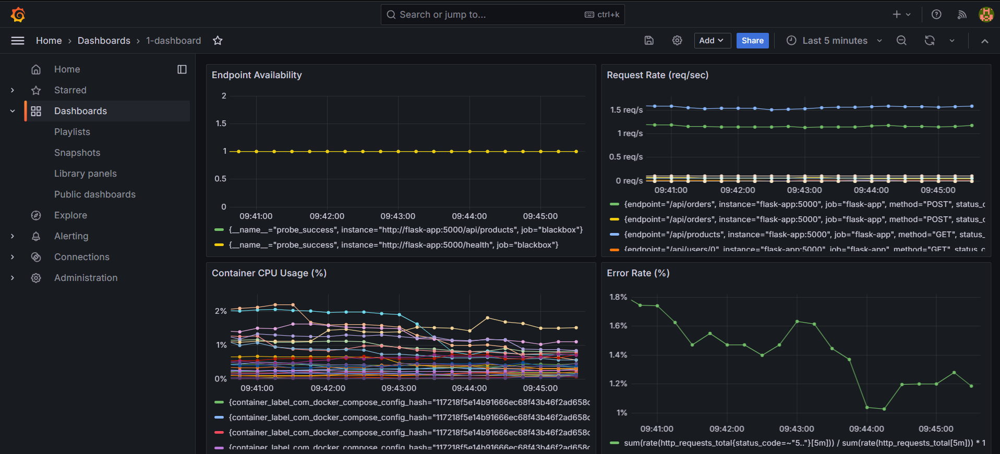
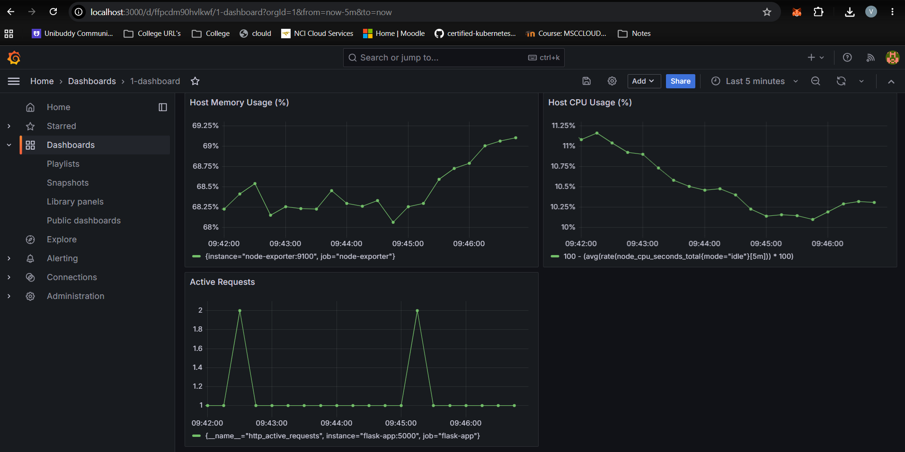
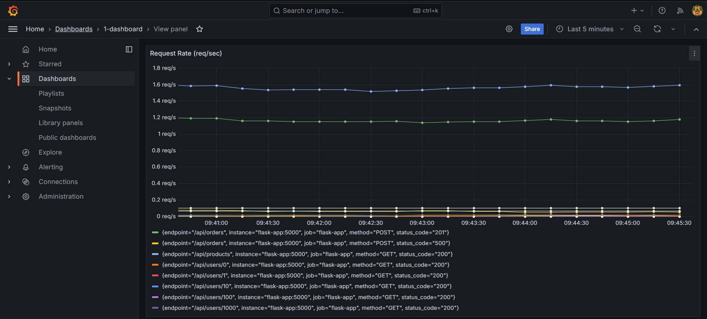
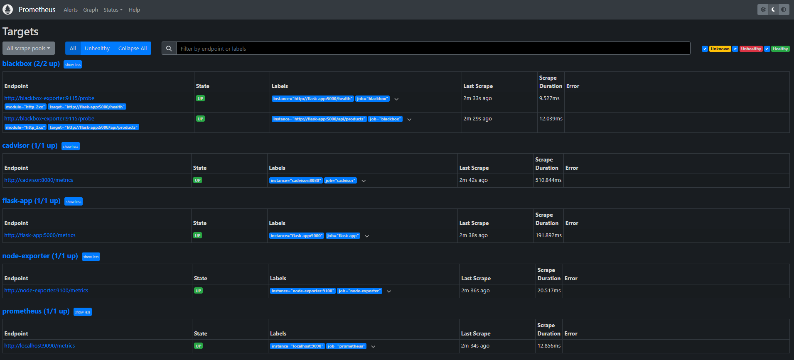
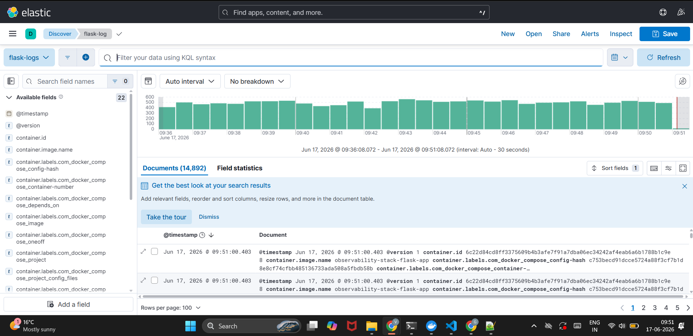
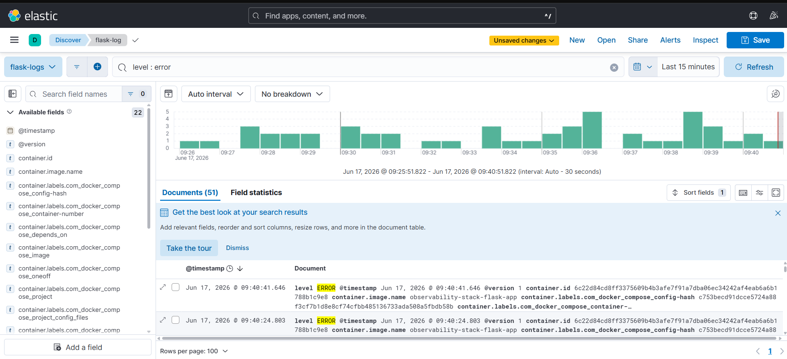
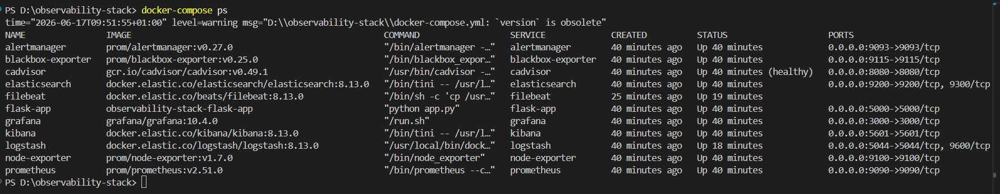

# Full Observability Stack — Prometheus · Grafana · ELK · Alerting

A production-grade monitoring and observability platform built from scratch, covering all 4 levels of monitoring: application, infrastructure, container, and endpoint. Built entirely locally with Docker Compose — no cloud account required to run it.




## What this project demonstrates

This is a fully working observability stack that monitors a sample Flask application across every layer of the stack — exactly how a production monitoring setup is built at a real company.

- **Application-level monitoring** — custom Prometheus metrics instrumented directly into a Flask app (request counts, latency histograms, active request gauges, error counters)
- **Infrastructure-level monitoring** — Node Exporter collecting host CPU, memory, disk, and network metrics
- **Container-level monitoring** — cAdvisor tracking per-container resource usage
- **Endpoint-level monitoring** — Blackbox Exporter probing live endpoints like a real user would
- **Centralised logging** — ELK Stack (Elasticsearch, Logstash, Kibana) with structured JSON logs, filtered log shipping via Filebeat, and Logstash enrichment
- **Alerting** — Prometheus alert rules with Alertmanager routing, grouping, and inhibition rules
- **Dashboards** — an 8-panel Grafana dashboard covering every monitoring level

## Architecture

The Flask app exposes a `/metrics` endpoint that Prometheus scrapes every 10 seconds. Filebeat watches Docker container logs, filters out everything except the Flask app's own logs, and ships them to Logstash, which parses the structured JSON and enriches it before storing in Elasticsearch. Grafana visualises Prometheus metrics, while Kibana provides log search and analysis. Alertmanager receives alerts from Prometheus and handles routing, grouping, and deduplication.

```
Flask App → Prometheus → Grafana
    ↓
Filebeat (filtered) → Logstash → Elasticsearch → Kibana

Prometheus → Alertmanager → Notifications
```

## Stack

| Tool              | Purpose                        | Monitoring Level |
| ----------------- | ------------------------------ | ---------------- |
| Prometheus        | Metrics collection and storage | Application      |
| Grafana           | Dashboards and visualisation   | All levels       |
| Node Exporter     | Host machine metrics           | Infrastructure   |
| cAdvisor          | Per-container metrics          | Container        |
| Blackbox Exporter | External endpoint probing      | Endpoint         |
| Alertmanager      | Alert routing and grouping     | —                |
| Elasticsearch     | Log storage and search         | —                |
| Logstash          | Log parsing and enrichment     | —                |
| Kibana            | Log visualisation              | —                |
| Filebeat          | Filtered log shipping          | —                |

## Dashboard

The Grafana dashboard includes 8 panels covering every monitoring level:

1. Request Rate (req/sec)
2. Error Rate (%)
3. P95 Response Time
4. Active Requests
5. Host CPU Usage (%)
6. Host Memory Usage (%)
7. Container CPU Usage (%)
8. Endpoint Availability





## Alert Rules

Alert rules are defined in `prometheus/alert-rules.yml` and cover:

- **FlaskAppDown** (critical) — fires if the app is unreachable for 1 minute
- **HighErrorRate** (warning) — fires if error rate exceeds 5% for 2 minutes
- **HighLatency** (warning) — fires if P95 latency exceeds 1 second for 5 minutes
- **EndpointDown** (warning) — fires if a Blackbox probe fails for 1 minute
- **HighMemoryUsage** (warning) — fires if host memory exceeds 85%
- **ContainerRestarting** (warning) — fires if a container restarts repeatedly within 5 minutes

Alertmanager handles grouping (avoiding alert storms when multiple rules fire at once), routing by severity, and inhibition rules (suppressing downstream warnings when a critical alert is already firing for the same root cause).

## Logging

Filebeat watches all Docker container logs but filters out everything except the Flask app's own output, using a `drop_event` processor matched on `container.name`. This keeps Elasticsearch clean — only application logs, not noise from Prometheus, Grafana, or Elasticsearch's own internal logging.

The Flask app outputs structured JSON logs with a `level`, `message`, `service`, and `timestamp` field. Logstash parses this JSON, tags error and warning logs, and forwards enriched documents to Elasticsearch. Over 14,000 log documents are typically generated per 15 minutes under the included traffic generator.



Logs are fully searchable using Kibana Query Language. For example, filtering to `level: ERROR` instantly narrows 14,000+ logs down to just the failures:



## Running locally

Requires Docker Desktop (with Kubernetes enabled if you want to also explore the Kubernetes manifests in `k8s/`, though the Docker Compose setup below does not require it).

```bash
git clone https://github.com/VarunKumarGampa/observability-stack.git
cd observability-stack
docker-compose up -d --build
```

Wait 2-3 minutes for all 11 containers to start, then verify:

```bash
docker-compose ps
```



Access each service:

| Service      | URL                          | Credentials      |
| ------------ | ---------------------------- | ---------------- |
| Flask App    | http://localhost:5000/health | —                |
| Prometheus   | http://localhost:9090        | —                |
| Grafana      | http://localhost:3000        | admin / admin123 |
| Kibana       | http://localhost:5601        | —                |
| Alertmanager | http://localhost:9093        | —                |

Generate sample traffic to populate the dashboards and logs:

```powershell
# PowerShell
while ($true) {
    Invoke-WebRequest http://localhost:5000/api/products -UseBasicParsing | Out-Null
    Invoke-WebRequest http://localhost:5000/api/users/$(Get-Random -Maximum 1200) -UseBasicParsing | Out-Null
    Invoke-WebRequest -Method POST http://localhost:5000/api/orders -ContentType "application/json" -Body '{"product_id":1}' -UseBasicParsing | Out-Null
    Start-Sleep -Milliseconds 500
}
```

To import the pre-built Grafana dashboard: go to Grafana → Dashboards → Import → upload `grafana/dashboards/overview-dashboard.json`.

To explore logs in Kibana: open Discover, create a Data View with index pattern `flask-logs-*` and timestamp field `@timestamp`.

## Stopping the stack

```bash
docker-compose down
```

This stops all containers but preserves all data (Prometheus metrics history, Grafana dashboards, Elasticsearch logs) in Docker volumes. Run `docker-compose up -d` again later and everything resumes exactly where it left off.

Never run `docker-compose down -v` unless you want to permanently delete all stored data — the `-v` flag removes the volumes.

## Problems solved while building this

Building this end-to-end surfaced a number of real issues that don't show up in tutorials, where the happy path is usually all you see. Documenting them here both for my own reference and because debugging them taught me more than the initial setup did.

### PromQL aggregation gave a flat 100% error rate instead of a real percentage

My first version of the error-rate panel was:

```promql
rate(http_requests_total{status_code=~"5.."}[5m])
/
rate(http_requests_total[5m])
```

This rendered as a flat 100% line regardless of actual traffic. The issue is that Prometheus divides vectors element-wise by matching labels, and since the numerator only has the `status_code="500"` series while the denominator has series for every status code, most pairs don't match — and the ones that do match end up comparing a metric to itself. Wrapping both sides in `sum()` collapses everything down to a single scalar per side first, so the division is a genuine total-errors-over-total-requests calculation:

```promql
sum(rate(http_requests_total{status_code=~"5.."}[5m]))
/
sum(rate(http_requests_total[5m]))
* 100
```

After the fix the panel settled at a realistic 1–1.5%, consistent with the app's deliberate 5% failure rate on the `/api/orders` endpoint specifically, diluted across all three endpoints.

### Filebeat refused to start on Windows with a permissions error

```
Exiting: error loading config file: config file ("filebeat.yml") can only be
writable by the owner but the permissions are "-rwxrwxrwx"
```

Filebeat has a hard-coded security check that refuses to load a config file if it's group- or world-writable, since on Linux that's normally a sign something's misconfigured. The problem is specific to bind-mounting from a Windows host into a Linux container: Docker Desktop on Windows doesn't carry over POSIX permission bits, so anything mounted from the Windows filesystem shows up inside the container as wide open, regardless of what it looks like in Windows Explorer. `chmod`-ing the file from PowerShell does nothing, because the permission model doesn't exist on that side.

The fix was to stop mounting the real config path directly and instead mount it under a different name (`filebeat.yml.orig`), then use a custom entrypoint that copies it to the expected location and runs `chmod`/`chown` from inside the Linux container, where those operations are actually meaningful:

```yaml
entrypoint: ["/bin/sh", "-c"]
command:
  - |
    cp /usr/share/filebeat/filebeat.yml.orig /usr/share/filebeat/filebeat.yml
    chmod go-w /usr/share/filebeat/filebeat.yml
    chown root:root /usr/share/filebeat/filebeat.yml
    exec filebeat -e
```

### Filebeat was shipping every container's logs, not just the app's

Once Filebeat was actually running, Elasticsearch started filling up with cAdvisor's internal scrape logs, Elasticsearch's own JVM startup logs, and Logstash's pipeline logs — anything writing to stdout/stderr on the host got picked up, because the input path `/var/lib/docker/containers/*/*.log` is a wildcard across every container Docker is running, with no awareness of which one I actually cared about.

Rather than try to filter this downstream in Logstash (which would mean processing and discarding a lot of irrelevant volume), I added a `drop_event` processor directly in Filebeat so irrelevant events never leave the collection layer:

```yaml
processors:
  - drop_event:
      when:
        not:
          equals:
            container.name: "flask-app"
```

This also matters for cost and performance in a real deployment — filtering at the edge instead of centrally means you're not paying to transport and index data you're going to throw away anyway.

### A single malformed log line crashed the entire Logstash pipeline

After fixing the filtering above, Logstash still crashed shortly after restart with repeated:

```
(TypeError) no implicit conversion of nil into Integer
Pipeline worker error, the pipeline will be stopped
```

The cause was a duration check in the filter block:

```ruby
if [duration] > 1.0 {
  mutate { add_tag => ["slow_request"] }
}
```

This assumes `[duration]` is always present and numeric. It mostly was, since the Flask app logs almost always include it — but any log line that didn't have that field (startup messages, non-JSON lines that slipped through, anything from before the JSON parse stage finished) caused Logstash to try comparing `nil > 1.0`, which isn't a valid operation and took the whole worker thread down. Once one worker dies this way the pipeline halts entirely, which is a fairly unforgiving failure mode for what looks like a minor edge case.

The fix was to guard the type before comparing, using a small Ruby filter instead of a bare conditional:

```ruby
ruby {
  code => "
    duration = event.get('duration')
    if duration.is_a?(Numeric) && duration > 1.0
      event.tag('slow_request')
    end
  "
}
```

This is a pattern worth internalising for any log pipeline: never assume a field exists or is the expected type just because it usually is. Production log streams are messier than they look in a demo.

### Stale Grafana panels after editing a saved dashboard

After exporting the dashboard JSON and re-importing it on a fresh `docker-compose down -v` test, some panels initially showed "Datasource not found" instead of rendering. The exported JSON had pinned the Prometheus datasource by its internal UID, which is regenerated on a clean install rather than being a stable identifier. The fix was re-pointing each panel's datasource to the named provisioned datasource instead of the UID, and re-exporting — after which the dashboard JSON became portable across fresh environments, which is the whole point of checking it into the repo in the first place.

## What I learned building this

- How Prometheus scraping and PromQL actually work under the hood, including common aggregation pitfalls, not just dashboard clicking
- The difference between application-level and infrastructure-level monitoring, and why both matter in a real incident
- How Filebeat, Logstash, and Elasticsearch fit together as separate, purpose-built tools, and why shipping logs through Logstash rather than directly to Elasticsearch gives you a processing layer
- How Alertmanager grouping and inhibition rules reduce alert fatigue in real incident response
- Docker networking fundamentals — why containers talk to each other by service name, not localhost
- Debugging a real, broken pipeline end-to-end — reading container logs, isolating which component failed, and fixing root causes rather than symptoms

## Tech Stack

Python · Flask · Docker · Docker Compose · Kubernetes · Prometheus · Grafana · Elasticsearch · Logstash · Kibana · Filebeat · Alertmanager · PromQL · KQL

---

Built as part of a hands-on DevOps upskilling project, targeting Azure DevOps Engineer roles in India.
